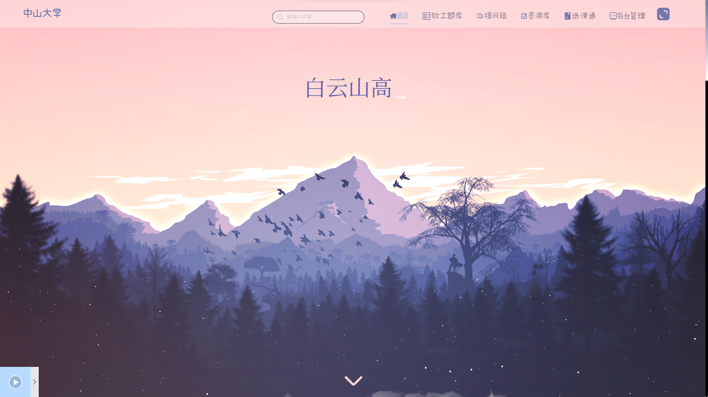
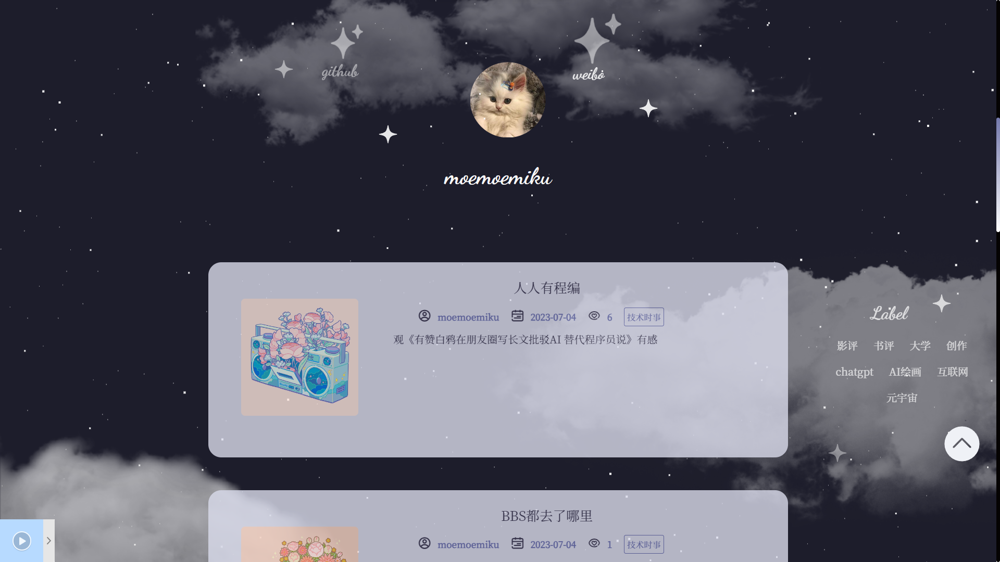

# BLOG
## Blog简介
这个网站是由几位软件工程学院的学生创建的个人博客，专门为软件工程学院的同学们、老师们提供一个交流、学习和资源分享的平台。  
项目的主要目标是为软件工程学院的学生提供一个定制化的平台，以满足他们在学术和学习方面的需求。通过提供与软件工程相关的文章、题库、学习资源和选课指南，希望帮助学生们更好地理解和应用软件工程知识，并促进他们的学术发展。  
 
## Blog功能介绍
* Blog文章
博客文章功能包括文章分类、访问次数统计、发布日期著明、文章内容查看等。这些功能旨在提供一个交流和学习的平台，让访客能够方便地浏览和阅读有关软件工程以及中大校园生活相关的文章，了解趣事。  
* 软工题库——答题测试
当访客访问我们的个人博客时，能够进行选择题目的答题测试。  
* 匿名提问箱
该提问箱是学院老师们经常使用的，给社恐的学生提供了一个提问的平台，可以不避讳地同提问箱的主人发表自己的观点和问题。 因此本组选择采用类似的形式，也使用匿名的形式，为访客提供了放开提问的机会。
* 软工学习资源库
当学生访问资源库模块时，能够进行资源分类、检索、下载和上传：
* 软工选课通
当访客访问我们的个人博客时，能够查看选课通，帮助学生了解课程的内容和要求。
* 后台管理
该功能用于对前台博客、分类、音乐、留言、上传资源、提问等进行管理与审核，从而加强对博客内容的监管、使得内容更严谨有序。

## 部分图片展示
* Blog首页  

* 提问箱功能  

* 资源库功能  

* 后台管理  

